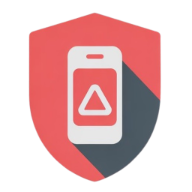

# SpamGuard: Dangerous Number Reporting System



## Description
**SpamGuard** is a community-driven platform designed to identify and report dangerous phone numbers.  
The application allows users to:
- Search for phone numbers to check if they have been reported as dangerous.
- View detailed information about reported threats.
- Contribute by reporting new suspicious numbers.  

Built as a protective tool against **phone scams, spam calls, and fraudulent activities**, SpamGuard helps users make informed decisions about which calls to answer or block.

---

## 🛠 Technologies Used
- **HTML5** – Structuring the web application
- **Tailwind CSS** – Responsive, utility-first styling
- **Vanilla JavaScript** – Client-side functionality without frameworks
- **localStorage API** – Client-side data persistence
- **Font Awesome** – Icons and visual elements

---

## ✨ Features

### Core Functionality
- **Number Search** – Quickly verify if a phone number has been reported.
- **Detailed Reports** – Comprehensive threat information including categories and descriptions.
- **Threat Categories** – Classify numbers by type (scam, spam, robocall, phishing, harassment).
- **Community Reporting** – Submit reports for dangerous numbers you encounter.
- **Report Management** – Edit or delete your submitted reports.

### User Experience
- **Responsive Design** – Optimized for mobile and desktop.
- **Visual Indicators** – Clear cues for dangerous numbers with color-coded categories.
- **Dashboard Statistics** – Overview of community activity with key metrics.
- **Safety Tips** – Educational content to help users avoid phone scams.

---

## 🚀 Setup Instructions

### Prerequisites
- A web browser with JavaScript enabled.
- No server setup required (application runs entirely client-side).

### Installation
Clone the repository:
```bash
git clone https://github.com/username/SpamGuard.git
```
Navigate to the project directory:
```bash
cd SpamGuard
```
For local development

Using VS Code:

- Install the Live Server extension.
- Click "Go Live".

Using npm:
``` bash
npm install
npm run preview
```

## 📖 Usage
- **Search:** Enter a phone number in the search bar to check if it's been reported.
- **Report:** Click **"Report Number"** to submit information about a dangerous call.
- **Review:** Browse recent reports to stay informed about current threats.

---

## 🤖 AI Support Explanation
This project was developed with AI assistance from **GitHub Copilot**, which helped with:

- **Code Generation:** Application structure, component templates, and JavaScript functions.
- **Styling Suggestions:** Responsive design with Tailwind CSS.
- **Bug Identification:** Detecting potential issues in the code.
- **Refactoring:** Improving code organization and maintainability.
- **Feature Implementation:** Search and report submission functionality.

The **core architecture decisions and concept** were human-directed, with AI providing implementation assistance and best-practice suggestions.  
This collaboration enabled **rapid development** while maintaining high code quality and user-focused design.

---

## 📜 License
This project was developed as part of the **IBM Full Stack Software Developer Professional Certificate** capstone project.

